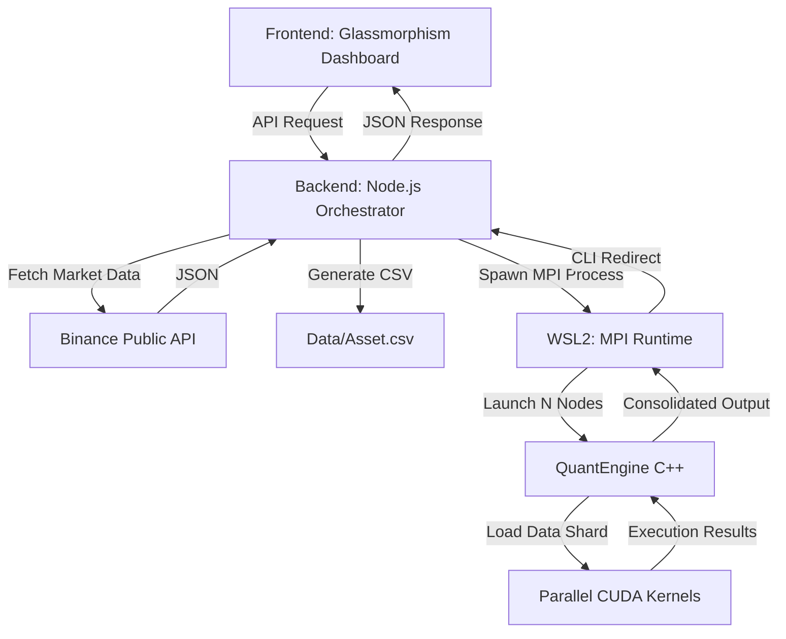

# PDC Technical Guide: QuantEngine

This document provides a detailed breakdown of the **Parallel and Distributed Computing (PDC)** architectures implemented in the QuantEngine project. This guide is intended for viva voce and project evaluations.

## 1. System Architecture Overview

QuantEngine follows a **Hybrid Distributed-Parallel** model:
- **Distributed Layer (MPI)**: Handles large-scale data sharding across multiple logical processors or nodes.
- **Parallel Layer (CUDA)**: Accelerates compute-intensive technical indicator calculations within each shard using the GPU's thousands of cores.
- **GUI Layer (Node.js)**: Provides an asynchronous interface for configuration and visualization.



---

## 2. Distributed Computing: MPI (Message Passing Interface)

### Data Sharding Strategy
QuantEngine uses a **Static Sharding** approach. The master node (Rank 0) determines the total size of the dataset and calculates the start and end offsets for each node in the cluster.

**Key Logic (`src/main.cpp`):**
```cpp
int shard_size = (int)data.size / size;
int start_pos = rank * shard_size;
int end_pos = (rank == size - 1) ? (int)data.size : (rank + 1) * shard_size;
```

- Each node only processes its assigned segment of the price action.
- This reduces the memory footprint on individual nodes and allows the simulation to scale horizontally as more compute resources are added.

---

## 3. Parallel Processing: CUDA (Compute Unified Device Architecture)

While MPI handles the data distribution, **CUDA** handles the "heavy lifting" within each shard. Technical indicators like RSI and Bollinger Bands require sliding window calculations that are perfectly suited for SIMT (Single Instruction, Multiple Threads).

### 1. Simple Moving Average (SMA) Kernel
Calculates the mean of the last `N` bars. In a CPU implementation, this is an $O(N \times M)$ operation. In CUDA, each thread calculates one SMA point in parallel.

### 2. RSI (Relative Strength Index) Kernel
Involves calculating average gains and losses over a lookback period. Each thread computes the change between consecutive bars, reducing the complexity of the $O(N)$ calculation per point.

### 3. Bollinger Bands (Standard Deviation)
This is the most compute-intensive part. It requires calculating the variance across a window:
$$ \sigma = \sqrt{\frac{\sum (x - \bar{x})^2}{N}} $$
The kernel utilizes the GPU's hardware-accelerated math units to perform square roots and power operations at massive scale.

---

## 4. Performance Metrics

- **Throughput**: Measured in "Bars per Second".
- **Latency**: The time taken from MPI initialization to completion.
- **Scaling Efficiency**: Ideally, doubling the number of MPI nodes should halve the processing time (linear scaling), assuming the dataset is large enough to overcome communication overhead.

## 5. Summary of Technologies

| Component | Technology | Role |
|-----------|------------|------|
| **Orchestration** | MPI (OpenMPI/MS-MPI) | Process management & Data distribution |
| **Compute Engine** | C++ / CUDA | Direct hardware acceleration (GPU) |
| **Backend** | Express / Node.js | Process spawning & Data fetching |
| **Frontend** | Vanilla JS / Lightweight Charts | Financial visualization |

---

> [!TIP]
> During evaluation, highlight that the separation of **Inter-node distribution (MPI)** and **Intra-node acceleration (CUDA)** is what makes this a true "High Performance Computing" (HPC) application.

---

## 6. VIVA PREPARATION: FAQs

### Q1: How do you scale the cluster size (change MPI nodes)?
**Answer:** The architecture uses a **Centralized Orchestrator** (the Node.js backend). You do not need to change the C++ code to scale. Instead, you modify the `MPI_NODES` constant in `gui_backend/server.js`. The backend then spawns the cluster using `mpirun -np <N>`.

### Q2: How does the C++ code handle different node counts?
**Answer:** The code is **node-agnostic**. It uses `MPI_Comm_size` to discover the node count at runtime. This allows the same binary to run on 1 node or 100 nodes without recompilation.

### Q3: What is "Data Sharding"?
**Answer:** It is the process of splitting a large dataset into smaller, independent chunks for each node to process. In our engine, we use *Static Partitioning*: 
`int shard_size = total_size / num_nodes;`
`int start_pos = rank * shard_size;`

---
*Created for PDC Evaluation 2026*
